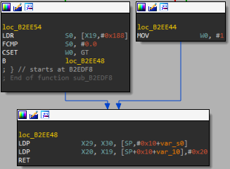

# ColorTweak

ColorTweak is an educational project demonstrating the process of patching the Color Switch game for research and learning purposes. This repository provides insights into the reverse engineering techniques and tools used to modify APK files.  
We'll use [`apkmod`](https://github.com/mon231/apkpatcher) to generate a patched apk of the beloved [color-switch](https://play.google.com/store/apps/details?id=com.colorswitch.switch2) game where we can't die when we hit obstacles.  

*NOTE* to use this project and the research for educational purposes only!

## Research Process

### 1. Understanding the APK Structure

Before diving into the patching process, it's essential to understand the structure of the Color Switch APK.  
This involves unpacking the APK and analyzing its contents to identify the target code segments.  

Using winrar or other zip-extracting tools, we can unzip the `.apk` file.  
Using `jadx`, we can reverse the java-bytecode out of the APK's `.dex` files.  

After I saw that there is no interesting code I can find in `jadx`,  
I turned to search for native libs, and found `libmain.so` loaded by the UnityPlayer's static-ctor:  

### 2. Extracting Native Libraries

I've copied the native-libs that match my phone's arch (arm64-v8a) from the apk,  
And started reversing the interesting ones of them, knowing that this is a unity application,  
And the interesting game's logic, including the "hit-obstacle" logic, will be found there.

Using `IDA`, we can see the `libmain.so` loads `libunity.so`:  

The `libunity.so` is a much bigger file, which contains a lot of compiled native-code,  
And seems to be written in cpp (contains a lot of cpp types and strings).  
We can for sure say that this lib only contains generic `unity` code which is common between many apps,  
And does not contain any interesting app-related logic.. This leads us to !
The `libil2cpp.so` is a native lib which is loaded by `libunity.so` (including calls to `il2cpp_init` function and logs about il2cpp initialization states),  
And contains application-spesific logic! Unfortunately, this library contains no types / symbols..

Well, luckily, tools like [`il2cppdumper`](https://github.com/Perfare/Il2CppDumper) are invaluable for extracting and decompiling these native libraries into readable C# interfaces and `IDA` scripts for typed functions and symbols.  
We'll use `il2cppdumper` on `assets/bin/Data/Managed/Metadata/global-metadata.dat` metadata and `lib/arm64-v8a/libil2cpp.so` lib.

### 3. Dynamic Analysis with Frida

After dumping symbols using `il2cppdumper`, feeding `IDA` with then and finding interesting functions / class members names, using common keywords, we can enjoy addresses of named functions, struct-members and other symbols for `IDA`!  
In the class `GameControllerColorSwitch`'s VirtualTable, we can find a methods named `hitKill` and `hitObstacle`:  

It would be very helpful to dynamically analyze the application. `Frida` allows us to hook into the application's execution flow, inspect memory, and dynamically modify behavior, providing valuable information for patching.  

Using frida-server (on rooted android device / emulator of `arm64-v8a` arch),  
I managed to inject scripts during application runtime and use frida's `Interceptor.replace` to "replace the implementation" of the `hitObstacle` method, and make the original apk to call my flow (nop) instead of the original one (fail the game).  
That way, I achieved the goal of making a patch for never losing the game!  
Complete code can be found right in this repo, at [`hitObstacle.js`](./hitObstacle.js).

During the research, I found another cool method I can use to gain the same behavior:  
Pathcing the method `isInvincible` to run it's logic then change it's return-value,  
Helped me always win the game and pass through obstacles without any problem 🥰  
Complete source for this solution can be found at [`invincible.js`](./invincible.js)

*NOTE* that the these patches could be inlined to the native-lib and patched using `IDA` only.  
For example, the last part of the `isInvincible` method implementation:  
  
Could be patched to always return `true` (1) using opcode-level patch of the app.

### 4. Patching with apkmod

Once the target code segments are identified, and simple fride scripts are written,  
[apkmod](https://github.com/mon231/apkpatcher) comes into play for patching the APK!  
[apkmod](https://github.com/mon231/apkpatcher) simplifies the patching process by providing a user-friendly interface for modifying APK files, making it accessible for anyone!  
Usage of the `apkmod` github-action can be found [here](./.github/workflows/create-patched-apk.yml),  
And patched APKs can be downloaded from the GithubActions artifacts or from the latest release of this project.

## Results

Original game video (loose when you hit obstacles):  

Patched game video (just play without fear of hitting obstacles):  

## Further Research

During the research, I found the method `tryContinueGame` which shows ad offerring to continue after watching it,  
Or calls the function `tryFreeContinueGame` if you have a premium subscription to the application, which allows you to continue without watching ads.  
It would be also interesting to utilize `hitKill` method, `hitObstacle` or `FailGame` inorder not to die.  
We also could use `frida` to trigger calls to `applyEasterEggs`/`applyBonusStars` and other methods.  
We can patch the constructor of `GameControllerColorSwitch_Fields` to change `easterEggRate`/`bonusStarRate`,  
To create new colors/balls of our own, and any other EDUCATIONAL PURPOSE ONLY research we'd like to develop!

## Disclaimer

ColorTweak is intended for educational and research purposes only.  
Any modifications made to the Color Switch game should comply with applicable laws and regulations.  
The developers of ColorTweak are not responsible for any misuse or illegal activities resulting from the usage of this project.
